# Performance of Networked Systems Assignment 2

## Homework assignment 2
Joseph Groot Kormelink (2655649)
Kai Zhang(S2666387)

## Question 1 Discovering Networks

### traceroute -m 30 google.com (VU campus wired) 
traceroute to google.com (172.217.168.206), 30 hops max, 60 byte packets
```
 1  130.37.164.2 (130.37.164.2)  0.579 ms  0.603 ms  0.635 ms
 2  130.37.250.125 (130.37.250.125)  0.563 ms  0.608 ms  0.652 ms
 3  130.37.6.102 (130.37.6.102)  0.320 ms  0.311 ms  0.332 ms
 4  130.37.6.92 (130.37.6.92)  1.368 ms  1.397 ms  1.339 ms
 5  e5-0.asd003a-jnx-01.surf.net (145.145.20.57)  10.473 ms  10.480 ms  10.473 ms
 6  72.14.220.250 (72.14.220.250)  1.179 ms  1.157 ms  1.155 ms
 7  * * *
 8  172.253.66.184 (172.253.66.184)  1.201 ms 72.14.238.244 (72.14.238.244)  1.153 ms 108.170.236.224 (108.170.236.224)  1.262 ms
 9  108.170.241.140 (108.170.241.140)  1.787 ms 108.170.227.3 (108.170.227.3)  1.987 ms 108.170.241.173 (108.170.241.173)  1.270 ms
 10  ams16s32-in-f14.1e100.net (172.217.168.206)  1.156 ms 216.239.42.211 (216.239.42.211)  1.701 ms 216.239.42.213 (216.239.42.213)  1.702 ms
```
* Bottleneck of this network:
  - For fibred network in VU, there's no bottleneck on transmition method of this network, because all nodes in VU are linked by fiber. The only limitation in VU's net is the speed of light, which cannot be changed.
  - For the net in VU, it has a little constraint on router which exchange info betwenn internal net to out net. The proceecssing time doubled on Hop 4.
  - For the net out of VU, it has constrain when it reach the local ISP's exchange devices, the queueing delay and processing delay happened here.
* Travers device and ISPs:
  Host -> VU Internal Nodes (Hop 1 - Hop 3) -> VU Outer Network Router (Hop 4) -> Surfnet NL Router (Hop 5) -> Google LLC Internal Nodes (Hop 6 - Hop 10)
* Most latency:
  - Most latency is introduced from Hop 5 (Surfnet NL Router) which is a Tier 3 ISP, Tier 3 ISP gethers data of an area or building, at ISP's exchange server there are a lot of transmitions in the queue need to check and to send out. 
  - This queuing latency can occur due to exchange point placement. Or, lack of effective peering agreements can cause congestion.
  - The processing delay is depend on processing ability of Tier 3's devices. So if VU want higher Internet Speed, VU need to negotiate with it's ISP  to have a higher ability device to deal with VU's net traffic to reduce queueing time and processing time.
### traceroute -m 30 google.com (VU campus wireless) 
  traceroute to google.com (172.217.168.206), 30 hops max, 60 byte packets
```
 1  130.37.56.1 (130.37.56.1)  1.994 ms  3.675 ms  1.424 ms
 2  130.37.8.81 (130.37.8.81)  2.709 ms  4.750 ms  2.216 ms
 3  dhcp-086-009.public.vu.nl (130.37.9.86)  2.067 ms  6.949 ms  1.744 ms
 4  130.37.6.102 (130.37.6.102)  1.858 ms  1.519 ms  1.471 ms
 5  130.37.6.92 (130.37.6.92)  3.006 ms  2.268 ms  2.223 ms
 6  e5-0.asd003a-jnx-01.surf.net (145.145.20.57)  2.282 ms  2.768 ms  2.425 ms
 7  72.14.220.250 (72.14.220.250)  2.485 ms  2.414 ms  2.395 ms
 8  * * *
 9  108.170.237.28 (108.170.237.28)  22.430 ms 108.170.236.134 (108.170.236.134)  8.572 ms 108.170.236.224 (108.170.236.224)  8.851 ms
10  108.170.241.172 (108.170.241.172)  8.956 ms 108.170.227.9 (108.170.227.9)  3.698 ms 108.170.241.173 (108.170.241.173)  8.691 ms
11  216.239.41.49 (216.239.41.49)  20.473 ms 216.239.42.213 (216.239.42.213)  12.626 msams16s32-in-f14.1e100.net (172.217.168.206)  12.412 ms
```
  * Bottleneck of this network:
    - In VU internal network, the bottleneck in this method is VU Net to users' devices transfer method. The RTT doubled in first step. This wireless bottleneck depends on both VU side's and User side's devices supported protocal and also depends on users' devices distance to nearest WIFI router. As test machine MacBook Pro 2018 supports 802.11ac, which is one of widely used high speed WIFI protocol, and VU also provided high speed connection protocal and with full signal. This limitation cannot be overcome in short time, cause signal transfer speed in air cannot faster than speed of light, but can be decrease by future wireless protocal.
    - Network out of vu, it seems that on Hop 9 node 1, the RTT suddenly bursted from 2.5 ms to 22.5 ms which nearly 10 time, at the same time it also more than two time of same Hop's other nodes' RTT time. This means it goes to a router with very high load, may be Google Inc will check this server and balance the traffic between different nodes later.
  * Travers device and ISPs:
    Host -> VU Internal Nodes (Hop 1 - Hop 2) -> VU Outer Network Router (Hop 3 - Hop5) -> Surfnet NL Router (Hop 6 - Hop 7) -> Google LLC Internal Nodes (Hop 9 - Hop 11)
 * Most latency:
  - For the part in VU, as described in bottleneck of this network and compared to wired type, it is no wonder that Transmission delay of gave the most comtribution to latency in last mile transmission.
  - For the part out of VU, as showed in Hop 9 node 1 and compared to other Hops and nodes, proceesing delay and queuing delay contributed most to transmission latency. Google may can check this node and impove their routing methodology to get balance traffic load.
### traceroute -m 30 google.com (Linode Cloud server IPv4)
traceroute to 172.217.168.206 (172.217.168.206), 30 hops max, 60 byte packets
```
 1  139.162.128.3 (139.162.128.3)  0.623 ms  0.708 ms  1.026 ms
 2  139.162.129.14 (139.162.129.14)  0.502 ms 139.162.129.16 (139.162.129.16)  0.483 ms 139.162.129.14 (139.162.129.14)  0.492 ms
 3  139.162.129.9 (139.162.129.9)  0.480 ms  0.475 ms de-cix.fra.google.com (80.81.193.108)  0.993 ms
 4  de-cix.fra.google.com (80.81.193.108)  0.989 ms  0.991 ms  0.984 ms
 5  209.85.245.30 (209.85.245.30)  4.406 ms 108.170.252.83 (108.170.252.83)  1.468 ms 209.85.252.77 (209.85.252.77)  1.359 ms
 6  108.170.229.168 (108.170.229.168)  4.383 ms 209.85.244.158 (209.85.244.158)  7.478 ms 108.170.229.168 (108.170.229.168)  3.893 ms
 7  216.239.40.230 (216.239.40.230)  7.430 ms 209.85.244.158 (209.85.244.158)  7.443 ms 209.85.255.231 (209.85.255.231)  9.004 ms
 8  108.170.241.193 (108.170.241.193)  7.022 ms 216.239.40.230 (216.239.40.230)  7.283 ms  7.245 ms
 9  108.170.241.193 (108.170.241.193)  7.058 ms 108.170.227.9 (108.170.227.9)  7.485 ms 108.170.241.225 (108.170.241.225)  8.078 ms
10  ams16s32-in-f14.1e100.net (172.217.168.206)  6.895 ms  6.839 ms  6.805 ms
```
* Bottleneck of this network:
 - For fibred network on Linode LLC's clould there's no bottleneck on transmition method of this network, because all nodes are linked by fiber. The only limitation is the speed of light. 
 - For the part out of Linode company, the RTT becomes high  from Hop5, this is because of two reasons. One is light transfer time from Germany to America. Another is processing latency and queuing latency from Google's server. 
* Travers device and ISPs:
  Host -> Linode Internal Nodes (Hop 1 - Hop 3) -> DE-CIX Management GmbH (Hop 4) -> Google LLC Internal Nodes (Hop 5 - Hop 10)
* Most latency:
  In this circumstance, it is very interesting, the Linode's server is directly linked to Tier 1 ISP, DE-CIX Management GmbH. Futhermore, all nodes are connected with fiber. The most latency is introduced queuing delay and processing at Hop 4. In contrast with VU wired, it shows that the more ability of the exchange server from ISP the less (processing) latency to end users. It also shows that the last mile problem is not only related with how the data/trasmitions is/are delivered but also related with Tier 3 ISP devices' capacity.

### traceroute -6 -m 30 google.com (Linode Cloud server IPv6)
2a00:1450:4001:81c::200e
```
traceroute to google.com (2a00:1450:4001:81c::200e), 30 hops max, 80 byte packets
 1  2a01:7e01::5287:89ff:fe40:a1c1 (2a01:7e01::5287:89ff:fe40:a1c1)  1.477 ms  1.500 ms  1.562 ms
 2  2a01:7e01:d::1 (2a01:7e01:d::1)  0.464 ms  0.466 ms 2a01:7e01:c::1 (2a01:7e01:c::1)  1.104 ms
 3  2a01:7e01:5::2 (2a01:7e01:5::2)  0.450 ms  0.500 ms  1.077 ms
 4  de-cix.fra.google.com (2001:7f8::3b41:0:2)  1.078 ms  1.073 ms  1.070 ms
 5  2001:4860:0:1::693 (2001:4860:0:1::693)  1.063 ms 2001:4860:0:11e1::1 (2001:4860:0:11e1::1)  2.103 ms  2.114 ms
 6  2001:4860:0:1::691 (2001:4860:0:1::691)  1.047 ms fra15s17-in-x0e.1e100.net (2a00:1450:4001:81c::200e)  1.171 ms  1.033 ms
```
* Bottleneck of this network:
  It uses the same device and internal network to connect to google, but in IPv6. There's no bottleneck on transmition method of this network, too, because all nodes are linked by fiber. The only limitation is the speed of light.
* Travers device and ISPs:
  Host -> Linode Internal Nodes (Hop 1 - Hop 3) -> DE-CIX Management GmbH (Hop 4) -> Google LLC Internal Nodes (Hop 5 - Hop 6)
* Most latency:
- In this circumstance, it is very interesting, the Linode's server is directly linked to Tier 1 ISP, DE-CIX Management GmbH IPv6 Peer. Futhermore, all nodes are connected with fiber. The most latency is introduced from queueing latency and processing latency at Hop 4. Most the same network condition with IPv4, but it is always faster no matter on which Hop.
  - In contrast with IPv4 and IPv6, it shows that IPv6 is much faster. This is not because IPv6 protocal is much better than IPv4 protocal. It because that IPv6 network is less used so lesss queueing time and less processing time for IPv6 requests.
  - It also proved that previous network congestion was mainly due to queuing & processing delay, not only Propagation delay.

### traceroute -m 30 google.com (home wired) 
traceroute  -m 30 172.217.168.206 
```
traceroute to 172.217.168.206 (172.217.168.206), 30 hops max, 60 byte packets
 1  _gateway (192.168.1.1)  0.425 ms  0.396 ms  0.377 ms
 2  ip-80-113-224-1.ip.prioritytelecom.net (80.113.224.1)  8.128 ms  8.114 ms  8.093 ms
 3  ip-80-113-24-209.ip.prioritytelecom.net (80.113.24.209)  3.340 ms  4.336 ms  4.748 ms
 4  asd-tr0021-cr101-be112-2.core.as33915.net (213.51.7.92)  3.267 ms  4.960 ms  3.867 ms
 5  asd-tr0021-cr101-be112-2.core.as33915.net (213.51.7.92)  3.175 ms  4.883 ms  3.137 ms
 6  nl-ams14a-ri1-ae51-0.aorta.net (213.51.64.186)  3.472 ms  3.349 ms  3.606 ms
 7  10ge-1-4.cr1.ams2.baseip.com (213.46.182.22)  3.867 ms  3.844 ms  3.822 ms
 8  * * *
 9  108.170.237.28 (108.170.237.28)  3.158 ms 108.170.241.161 (108.170.241.161)  6.450 ms 108.170.236.134 (108.170.236.134)  3.410 ms
10  108.170.227.9 (108.170.227.9)  6.679 ms 108.170.241.172 (108.170.241.172)  6.392 ms  6.377 ms
11  ams16s32-in-f14.1e100.net (172.217.168.206)  6.346 ms  6.339 ms 216.239.42.211 (216.239.42.211)  5.830 ms
```
* Bottleneck of this network:
It has a gateway router before it links to world wide internet, this router's weak bandwidth and ability to resolve bursts makes it the bottleneck of this network.
* Travers device and ISPs:
  - Host -> Home gateway router (Hop 1) -> Priority Telecom ISP servers (Hop 2 - Hop 3) -> Vodafone Libertel B.V ISP servers (Hop 4 - Hop 5) -> Ziggo Community ISP servers (Hop 6) -> Base IP B.V. ISP servers (Hop 7) -> Google LLC Internal Nodes (Hop 9 - Hop 11)
  - Note: Priority Telecom, Vodafone Libertel B.V., Ziggo Community, Base IP B.V. all belong to Vodafone's network
* Most latency:
Most latency is introduced at Hop 2, it combined two part. The first is part is because the home router's weak ability which will introduce processing latency. The second part is because exchange server of ISP have lots of users' requests to process and queueing. It also introduce processing and queueing latency.

### Traceroute -m 30 google.com (home wireless) 
traceroute  -m 30 172.217.168.206 
```
traceroute to 172.217.168.206 (172.217.168.206), 30 hops max, 60 byte packets
 1  _gateway (192.168.1.1)  7.565 ms  8.326 ms  8.297 ms
 2  ip-80-113-224-1.ip.prioritytelecom.net (80.113.224.1)  28.472 ms  28.924 ms  28.898 ms
 3  * * *
 4  asd-tr0021-cr101-be112-2.core.as33915.net (213.51.7.92)  11.106 ms  11.814 ms  11.774 ms
 5  asd-tr0021-cr101-be112-2.core.as33915.net (213.51.7.92)  10.705 ms  10.962 ms  10.937 ms
 6  nl-ams14a-ri1-ae51-0.aorta.net (213.51.64.186)  11.177 ms  6.011 ms  11.662 ms
 7  10ge-1-4.cr1.ams2.baseip.com (213.46.182.22)  8.341 ms  8.878 ms  9.524 ms
 8  * * *
 9  108.170.236.222 (108.170.236.222)  9.493 ms 108.170.241.161 (108.170.241.161)  9.333 ms 108.170.237.28 (108.170.237.28)  9.477 ms
10  108.170.241.173 (108.170.241.173)  9.312 ms 108.170.227.9 (108.170.227.9)  9.306 ms 108.170.227.3 (108.170.227.3)  10.941 ms
11  ams16s32-in-f14.1e100.net (172.217.168.206)  10.419 ms  10.893 ms  10.889 ms
```
* Bottleneck of this network
  - Transfer media type & device ability: WIFI 2.4 GHZ 802.11.g, it's max data rate is 300 Mbps which is much slower than wired connection.
  - Router's processing ability: Router's weak bandwidth and ability to resolve bursts makes it the bottleneck of this network.
* Travers device and ISPs:
  - Host -> Home gateway router (Hop 1) -> Priority Telecom ISP servers (Hop 2) -> Vodafone Libertel B.V ISP servers (Hop 4 - Hop 5) -> Ziggo Community ISP servers (Hop 6) -> Base IP B.V. ISP servers (Hop 7) -> Google LLC Internal Nodes (Hop 9 - Hop 11)
* Most latency:
Most latency is introduced at Hop 1, it slows trasmition rate a lot, which incsreas from mean 0.4 ms to 8 ms. Moreover, processing ability of the user's router also introduced processsing latency to the requests.

### Conclusion
It shows that the last mile problem related with following points:
1. transmition deliver type
    * wired or wirelessed 
    * fiber or copper wired
2. Routing methodology
3. ISP devices processing ability
    * ISP's devices, especially Tier 3 ISP's devices, processing ability is very important.
4. user's related device processing ability
    * router's processing ability
    * router's in/out bandwith
    * target device bandwidth and so on
5. Transmition density
    Different transmition communication protocal or different location can have different transmition density.

## Question 2 Deep Packet Analysis
### 2.1. Provided trace
#### For all protocal
* The IP address of the hosts of interest is 10.0.2.15(IPv4) and fe80::bedd:b62f:33c9:a477 (IPv6), because all HTTP GET/POST request send from the IPv4 and all TCP's SYN, which is start of TCP signal send from local to remote server to establish TCP connection, is sent from this IPv4. The UDP requests all send from these two IPs.
#### IP Protocal
1. IP Protocal has two types: 
  * Internet Protocol Version 6 (IPv6): fe80::bedd:b62f:33c9:a477 (IPv6 Location)
  * Internet Protocol Version 4 (IPv4): 10.0.2.15 (IPv4 Location)
2. Different IP Protocal Statistics:
  * IPv6: 6 Packets (0.01%)
  * IPv4: 35952 Packets (99.99%)
  * All: 35958
  This means our interest host does not use IPv6 service much.
#### TCP Protocal
1. TCP Protocal Statics:
  * TCP Packets: 33851 Packets 
  * TCP Percentages: 33851 / 35958 = 94.1%
2. TCP Round Trip Time
As RTT defninition, it is depends on two hosts' location, the closer two host are, the lower RTT time.
  * 10.0.2.15 <=> 211.152.136.73
    Location: Shenzhen, China
    RTT Min around: 0.035ms 
    RTT Max around:  1.3ms
    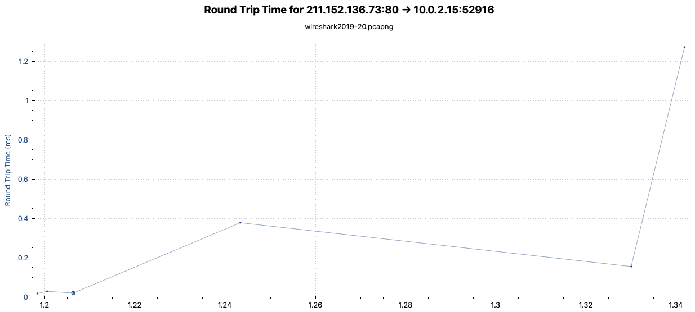
    Windows Scaling Min: 65535 Bytes
    Windows Scaling Max: 76749 Bytes
    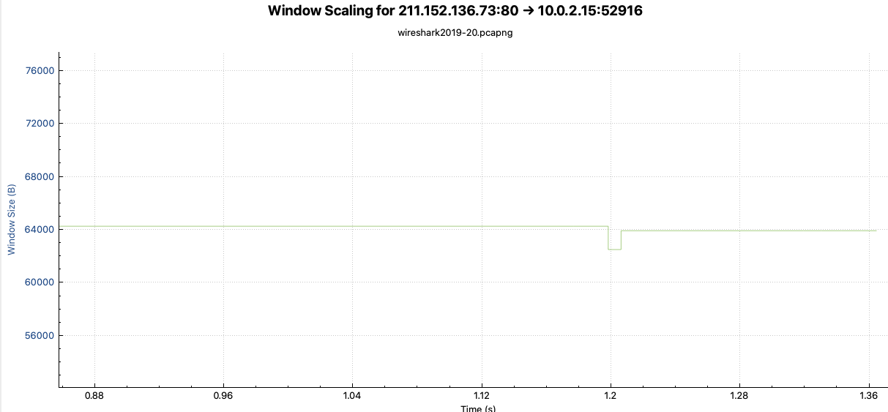
  * 10.0.2.15 <=> 1.31.173.91
    Location: Inner Mongolia Autonomous Region (NM), China
    RTT Min around: 0.0175ms 
    RTT Max around: 0.026ms 
    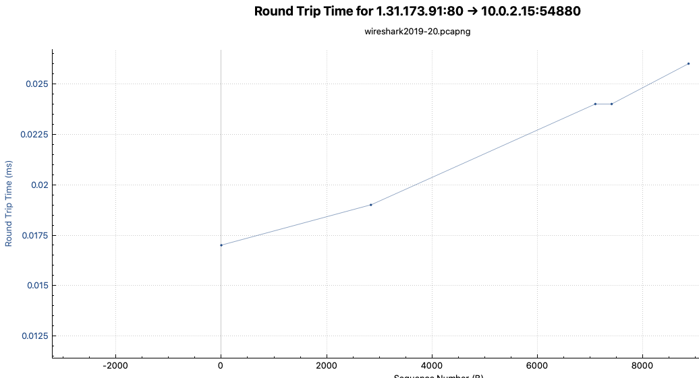
    Windows Scaling Min: 64240 Bytes
    Windows Scaling Max: 63900 Bytes
    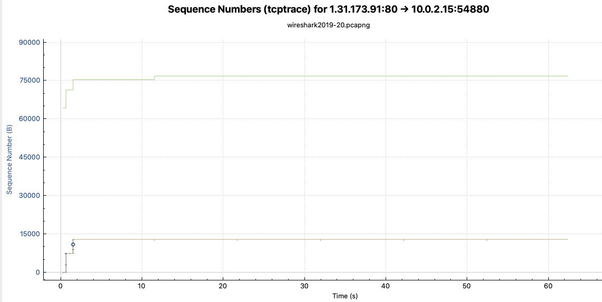
  * 10.0.2.15 <=> 175.100.207.205
    Location: Hong Kong, China
    RTT Min around: 0.009ms 
    RTT Middle around: 0.02ms 
    RTT Max around: 0.046ms 
    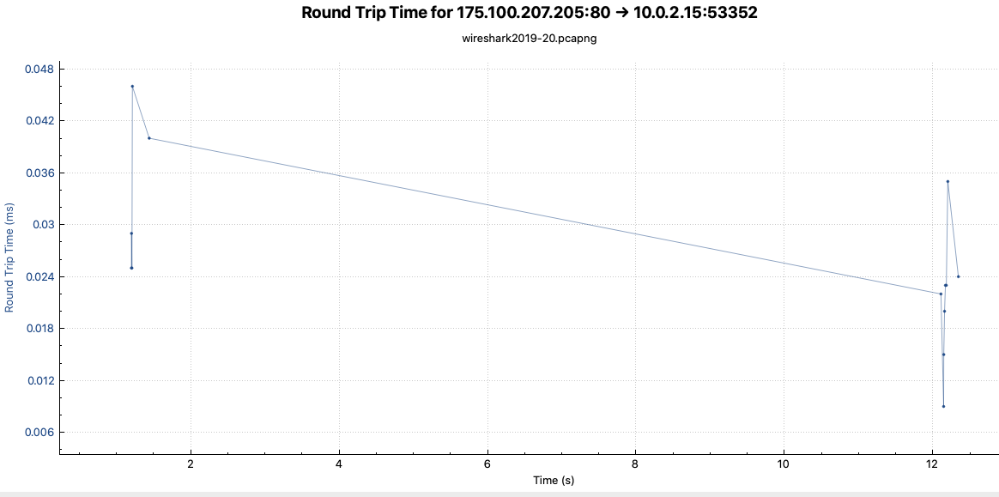
    Windows Scaling Min: 56800 Bytes
    Windows Scaling Max: 63900 Bytes
    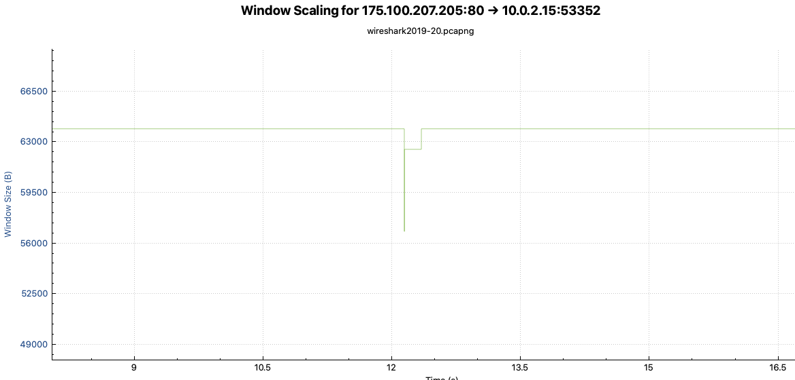
  * 10.0.2.15 <=> 74.125.100.40
    Location: United States (US), North America
    RTT Min around: 0.8ms 
    RTT Middle around: 3.1ms 
    RTT Max around: 5.78ms 
    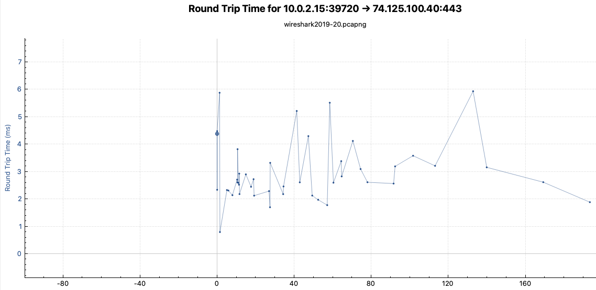
    Windows Scaling Min: 65535 Bytes
    Windows Scaling Max: 65535 Bytes
    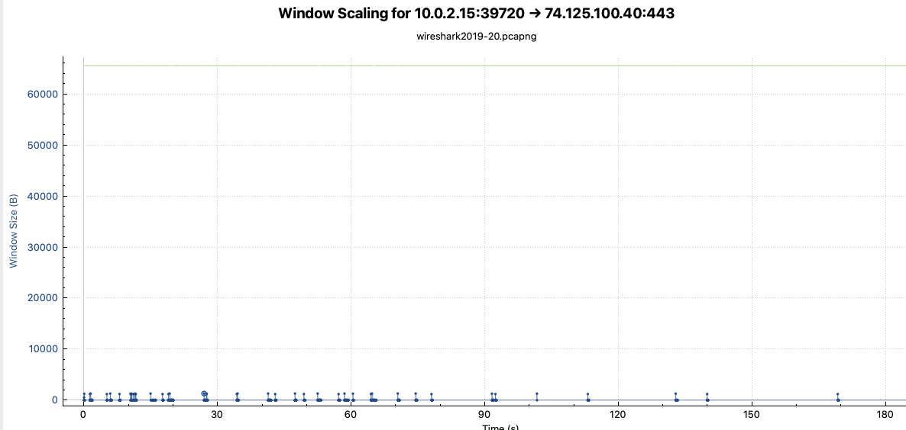
  * 10.0.2.15 <=> 47.246.48.251
    Location: United States (US), California (CA), North America
    RTT Min around: 2.02ms 
    RTT Max around: 7.6ms
    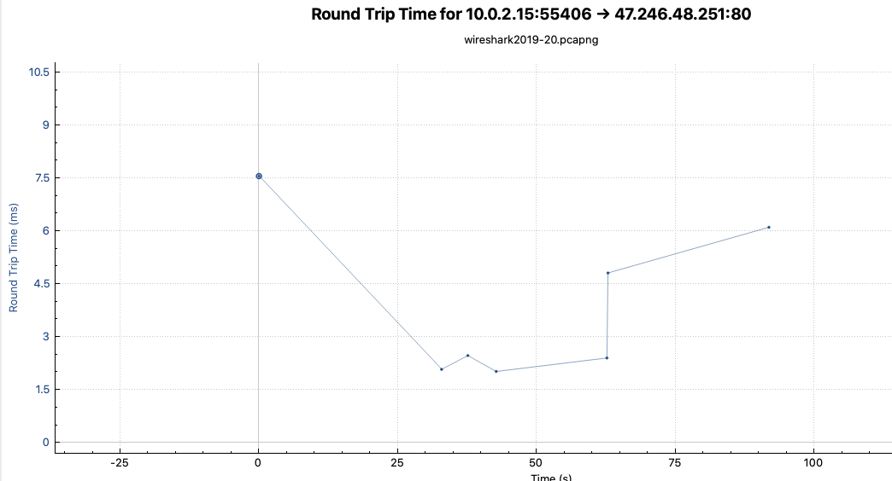
    Windows Scaling Min: 65535 Bytes
    Windows Scaling Max: 65535 Bytes
    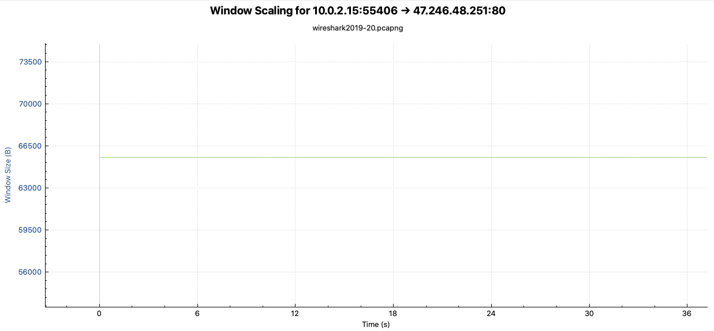
  * 10.0.2.15 <=> 185.94.180.126
    Location: Netherlands (NL), Europe
    RTT Min around: 0.7ms 
    RTT Middle around: 3ms 
    RTT Min around: 6.6ms 
    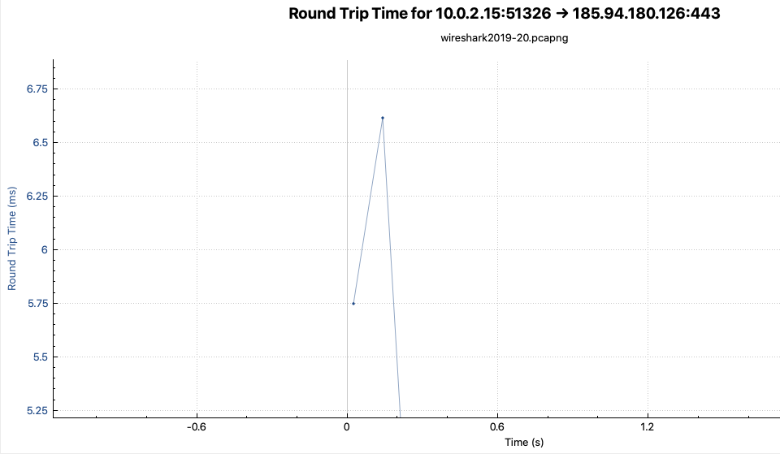
    Windows Scaling Min: 65535 Bytes
    Windows Scaling Max: 65535 Bytes
    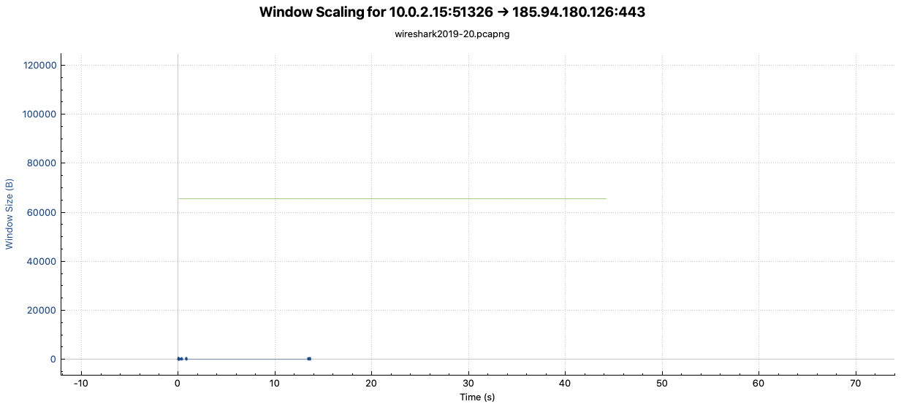
It seems that the interest host is somewhere around China, or in High Speed Internet Asian country.
#### UDP Protocal
1. UDP Protocal Statics:
  * UDP Packets: 2073(IPv4) + 6(IPv6) Packets 
  * UDP Percentages: 2079 / 35958 = 5.9%
#### HTTP Protocal
1. HTTP Protocal Statics:
  * HTTP Packets: 1756 Packets 
  * HTTP Packets Percentage: 1756 / 35958 = 4.9%
  * HTTP Bytes: 21680719 Bytes
  * HTTP Bytes Percantage: 21680719 / 98137444 = 22.1%
  * Data types that consume the most traffic: Media/Pictures (PNG Files(2%) + JPEG Files(9%) + MEDIA Files(8.5%) = 19.5% of all Data Bytes)
  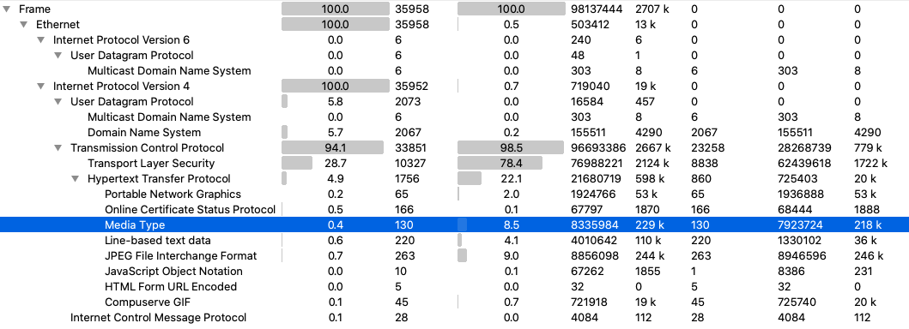

### 2.2 Own trace
#### For all protocal
* The IP address of the hosts of interest is `192.168.0.1` on local network, `80.113.225.127` on Dynamic IP (IPv4) and `fe80::8f3:92ff:fe9b:5d34` (IPv6), because all HTTP GET/POST request send from the IPv4 and all TCP's SYN, which is start of TCP signal send from local to remote server to establish TCP connection, is sent from this IPv4. The UDP requests all send from these two IPs.
* Total Transfered Bytes: 43768859 Bytes
#### IP Protocal
1. IP Protocal has two types: 
  * Internet Protocol Version 6 (IPv6): fe80::8f3:92ff:fe9b:5d34 (IPv6 Location)
  * Internet Protocol Version 4 (IPv4): `192.168.0.1`(Local Host), `80.113.225.127` on Dynamic IP (IPv4)
2. Different IP Protocal Statistics:
  * IPv6 Packets: 236 Packets (0.4%)
  * IPv4 Packets: 54560 Packets (99.6%)
  * All: 54861
  This means our choiced host does not use IPv6 service much.
#### TCP Protocal
1. TCP Protocal Statics:
  * TCP Packets: 21457 Packets 
  * TCP Percentages: 21457 / 54861 = 39.1%
2. TCP Round Trip Time
As RTT defninition, it is depends on two hosts' location, the closer two host are, the lower RTT time.
  * 192.168.0.1 <=> 92.123.165.41
    Location: Netherlands, Europe
    RTT Min around: 8.3ms
    RTT Max around:  14.6ms
    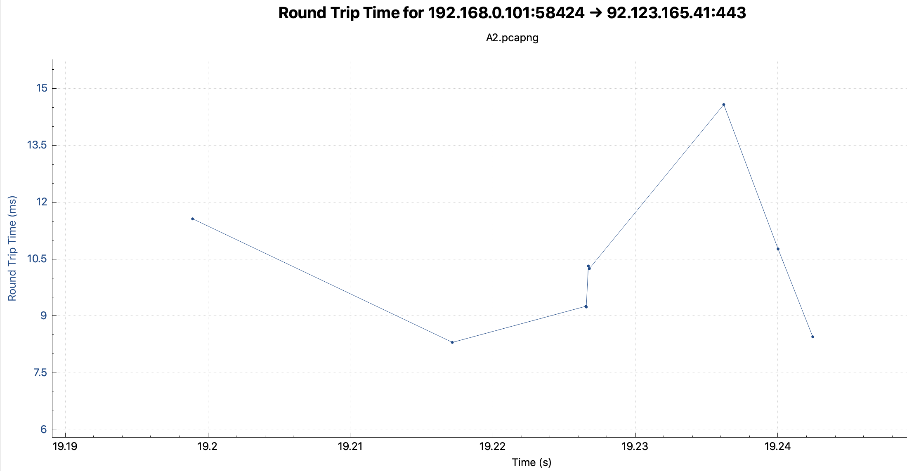
    Windows Scaling Min: 30080 Bytes
    Windows Scaling Max: 31104 Bytes
    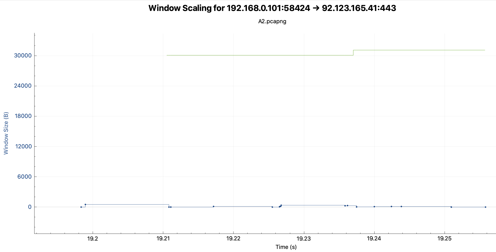
  * 192.168.0.1 <=> 64.58.121.60
    Location: Ashburn, United States, North America
    RTT Min around: 161ms
    RTT Max around:  205ms
    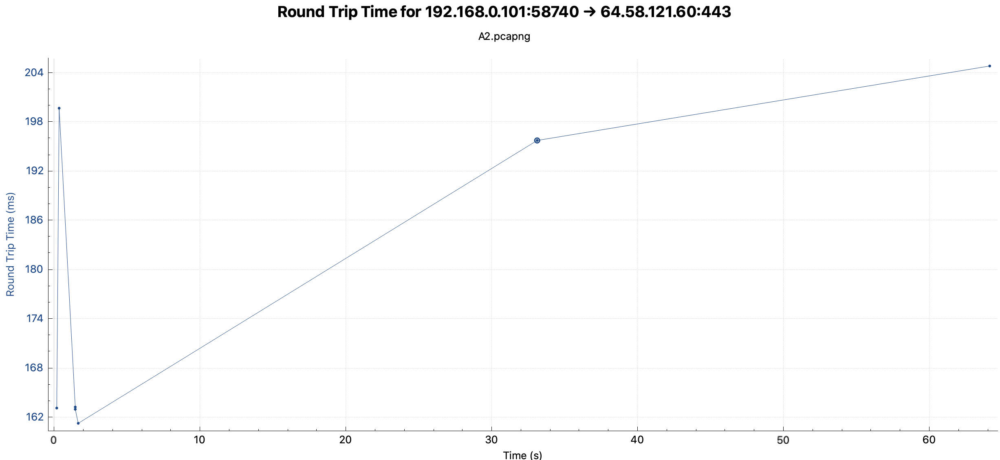
    Windows Scaling Min: 9216 Bytes
    Windows Scaling Max: 17400 Bytes
    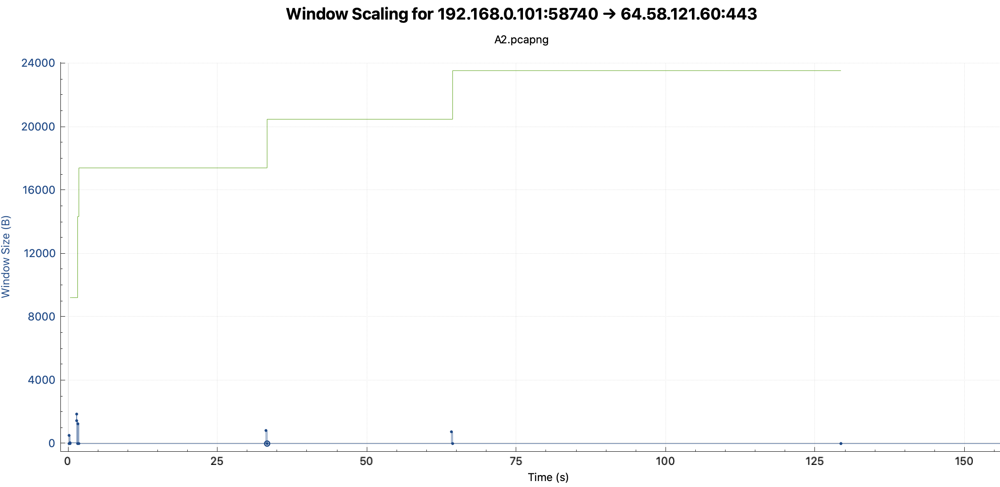
  * 192.168.0.1 <=> 58.251.82.205
    Location: GuangZhou, China, Asia
    RTT Min around: 289ms
    RTT Max around:  404ms
    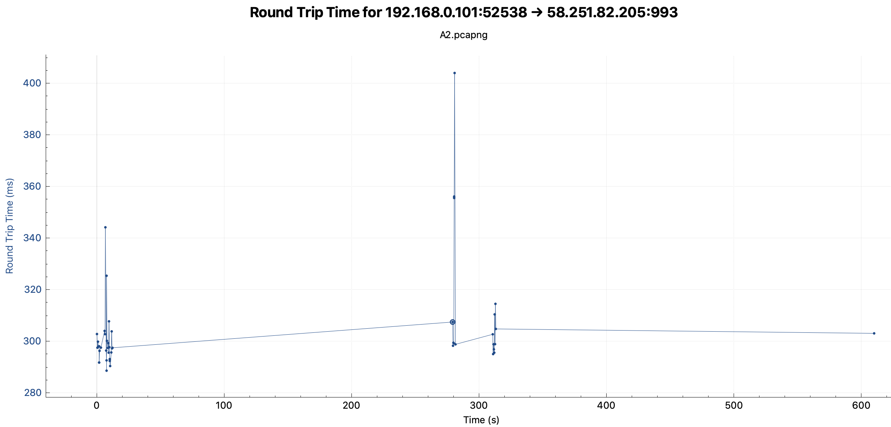
    Windows Scaling Min: 443 Bytes
    Windows Scaling Max: 443 Bytes
    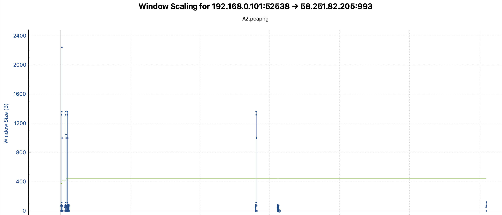
The Netherlands RTT is the shortest among three cases, also along with real situation.
#### UDP Protocal
1. UDP Protocal Statics:
  * UDP Packets: 33077(IPv4) + 63(IPv6) Packets 
  * UDP Packets Percentages: 33140 / 54861 = 60.4%
  * UDP Transfered Bytes Percentages: 35084090 / 43768859 = 80.2%
This means the example host is mainly interacting with UDP based applications. It have high percentage that user is having fun with Video/Audio/Games.
#### HTTP Protocal
1. HTTP Protocal Statics:
  * HTTP Packets: 16 Packets 
  * HTTP Packets Percentage: 16 / 54861 = 0.029%
  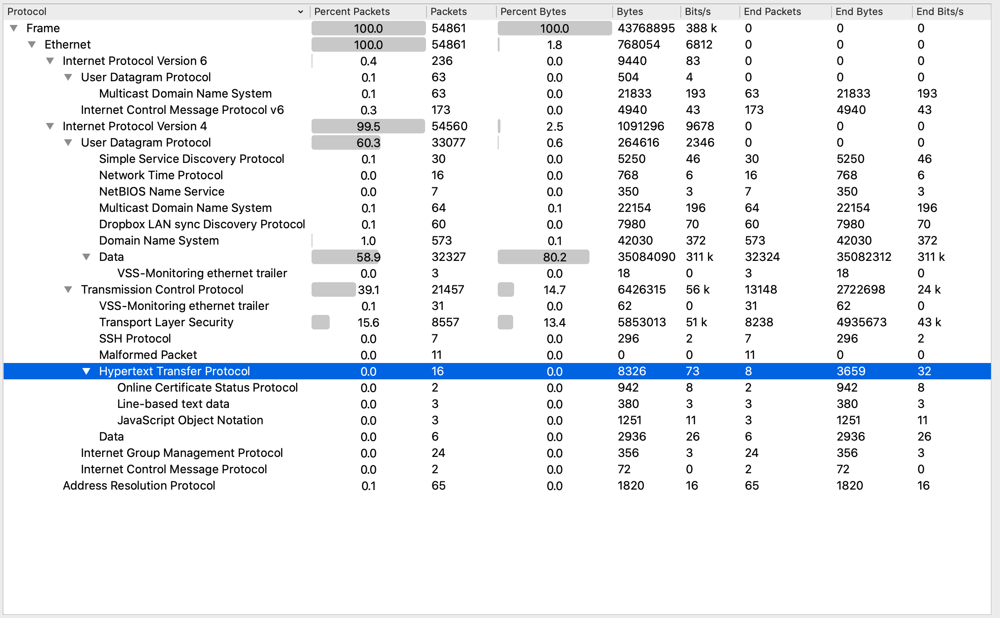

## Question 3 Performance of Mobile Apps
### 3.1. Analysis: Clothing for Primark app
1. Text File Compression
  * Problem:
    8% of text files were sent out without compression. Text compression can reduce time delivery time.
  * Solution:
    But for current Primark app it is not a big problem. From the table and the video we found that, `staticxx.facebook.com` is not requested by the app. Only 1810 + 1984 + 27018 = 30812 Bytes, less than 4% text files are sent in non-compressed type over network. But it still need attention, because app's related request time is around 200ms - 300ms which can affect user experience. App development needs attention on data transfer compression.
    |Time               |Host Name                                          |File Size|
    |-------------------|---------------------------------------------------|---------|
    |41.51699995994568	|staticxx.facebook.com	                            |33360    |
    |226.3140001296997	|tags.bluekai.com	                                  |1810     |
    |281.02500009536743	|d2xgf76oeu9pbh.cloudfront.net	                    |1984     |
    |289.6470000743866	|d303e3cdddb4ded4b6ff495a7b496ed5.s3.amazonaws.com	|27018    |

2. Duplicate Content
  * Problem:
    The duplicate content request start with `/fr/...` is requested by `facebook.com` so it is not related with this app. Another dupicate request `\error_404` is linked with current app.
    Though the ATT Video Optimizer did not show it has problem, it shows potential problem on app development. It means some special static page (like error page) is not cached on app and need to request from server a lot of time.
    |File Size|Count |File Name                                                                          |
    |---------|------|-----------------------------------------------------------------------------------|
    |57	      |2	   |/fr/u.php?t=2592000&p=443937282305007&m=M2YzNmYzOTI1YzhkZTMzNDNjZjE2ODFmNGZjNDNiZGI|
    |13253	  |4	   |/error_404.aspx?aspxerrorpath=/checkpage.aspx                                      |
  * Solution:
    This 404 page is quite large, which can be stored in cache of app once the app get 404 status, it can show the app version error page directly, which is also can be implemented to other error pages.

3. Cache control
  * Problem:
    Absence of cache headers 17% of times.
  * Solution:
    The app contains a lot of images, the app request the images every time the app needs. Those images need a lot of bandwiths to transfer, but a lot of dupilcate request. It can cache pictures in app, so that can reuse the images, and set a timeout that can check if there's new version of image updated.

4. Combine JS and CSS Requests
  * Problem:
    Multiple requests for CSS or JS can slow loading. Multiple CSS or JS need more requests from the server, it need wait more time because the application need more RTT time.
  * Solution:
    Combines the JS files and CSS files of primark.com

5. Resize Images for Mobile
  * Problem:
    When the app got image requests from primark server, either from `primark.com` or from `10.120.0.1`, it did not check if there is mobile version and smaller version for mobile. It downloaded desktop vernsion and big high-quality, which is too high for mobile, directly and wasted times.
    |Time              |Host Name         |Image Size|
    |------------------|------------------|-------|
    |4.676000118255615 |	www.primark.com	|25073	|
    |23.061000108718872|	10.120.0.1	    |643061	|
    |23.026000022888184|	10.120.0.1	    |31646	|
    |23.187999963760376|	10.120.0.1	    |540811	|
    |23.006999969482422|	10.120.0.1	    |138314	|
    |23.03500008583069 |	10.120.0.1	    |187140	|
    |23.246000051498413|	10.120.0.1	    |131659	|
    |23.325000047683716|	10.120.0.1	    |25073	|
    |55.71600008010864 |	10.120.0.1	    |44295	|
    |55.71399998664856 |	10.120.0.1	    |117752	|
    |55.746999979019165|	10.120.0.1	    |103291	|
    |55.74300003051758 |	10.120.0.1	    |78705	|
    |55.72099995613098 |	10.120.0.1	    |121184	|
    |55.75500011444092 |	10.120.0.1	    |158516	|
    |131.55100011825562|	10.120.0.1	    |128679	|
    |131.6579999923706 |	10.120.0.1	    |112053	|
    |131.74300003051758|	10.120.0.1	    |109907	|
    |131.77500009536743|	10.120.0.1	    |131659	|
    |170.92300009727478|	10.120.0.1	    |435603	|
    |170.99900007247925|	10.120.0.1	    |112036	|
    |170.92899990081787|	10.120.0.1	    |1623	  |
    |171.00600004196167|	10.120.0.1	    |91737	|
    It also had many requests from ebay.
    |Time              |Host Name         |Image Size|
    |------------------|------------------|-----|
    |205.92199993133545|ir.ebaystatic.com	|12716|
    |205.90700006484985|ir.ebaystatic.com	|17228|
    |221.53900003433228|ir.ebaystatic.com	|15586|
    |221.88899993896484|ir.ebaystatic.com	|5251	|
    |232.12800002098083|i.ebayimg.com   	|92296|
    |232.63499999046326|i.ebayimg.com   	|61949|
    |237.99300003051758|i.ebayimg.com   	|76054|
  * Solution:
    - For those requests from `primark.com` and `10.120.0.1`, developers can make multiple version/size pics for different target devices, like desktop, pad, mobiles.
    - For those requests from `primark.com` and `10.120.0.1`, developers can make a script to check target deivce's ppi, width and hight and request right version pics.
    - For thos requests from ebay we can do nothing, because it directly access the web page from Ebay Inc.

6. Image Compression
  * Problem:
    The app requested a lot of big pics from server for display. If it can be compressed, it will save a lot of space.
  * Solution:
    Shrink the physical size of the image by keeping the proportions while making the whole thing smaller. In other words, a 60 x 60 pixel image is reduced to 40 x 40 pixels.

7. Image Format
  * Problem:
    Newer image formats (like WebP for Android and JPEG2000 for iOS) feature the same visual quality as traditional formats (like JPEG and GIF, etc.) but offer much higher compression. But in this app it almost all uses `.jpg` files to display things.
  * Solution:
    Developers can make `.WebP` and `JPEG2000` image backup for different devices.
    Developers can make a script to check target deivce's OS, and diliver corresponding righ version images.

8. Minify CSS,JS and HTML
  * Problem:
    Many text files contain excess whitespace to allow for better human coding. There are many spaces in or CSS/JS/HTML file
  * Solution:
    Preporcess the CSS/JS/HTML files, remove unnecessary spaces of them before they send out.

9. Use CSS Sprites for Images
  * Problem:
    Some small and simple images like banner/logo/icon and so on can be generatetd by css. We can combine these to css files. Furturemore, many of them consumes nearly 300ms, if it will replaced by css it will reduce request time a lot,.
  * Solution:
    Use CSS to generate small simage iamges linke banner/logo/icons.

10. Unnecessary Connections - Multiple Simulateneous Connections
  * Problem:
    Mutiple communication result to one customer require much more capacity from the app server. This leads to the app company can serve less actual customer.
    |Time     |IP             |Domain Name                |No of connections|
    |---------|---------------|---------------------------|--|
    |21.332	  |10.120.0.1	    |10.120.0.1	                |33|
    |226.77	  |23.206.93.243	|ads.rubiconproject.com	    |3 |
    |23.669	  |216.58.209.78	|apis.google.com	          |7 |
    |351.359	|46.137.92.249	|d.adroll.com	              |6 |
    |226.063	|23.61.248.18	  |di67.shoppingshadow.com	  |3 |
    |278.647	|216.58.209.67	|fonts.gstatic.com	        |4 |
    |55.433	  |92.61.231.12	  |images.primark.com	        |15|
    |0.288	  |192.168.178.38	|images.primark.com	        |5 |
    |226.638	|23.61.248.58	  |img.shopping.com	          |9 |
    |204.378	|2.16.153.57	  |ir.ebaystatic.com	        |6 |
    |22.797	  |92.61.231.11	  |m.primark.com	            |18|
    |226.891	|23.0.213.206	  |pixel.mathtag.com	        |3 |
    |277.974	|54.231.141.204	|s3-eu-west-1.amazonaws.com	|18|
    |204.569	|23.206.112.91	|thumbs3.ebaystatic.com	    |71|
    |349.928	|31.13.64.36	  |www.facebook.com	          |3 |
    |276.809	|134.213.58.117	|www.misspap.co.uk	        |15|
  * Solution:
    Limits per device's the api usage for each api to three.

11. Multiple Simultaneous Connections to Many Endpoints
  * Problem:
    It typically happens when a connection is not deliberately closed as part of the transmission and is terminated later when the connection times out.
  But it is very infficient to do in that way.
  * Solution:
    Closing connections promptly from app, this will reduce battery drain.

12. 3rd Party Scripts
  * Problem:
    Two 3rd party scripts synchronously load 3rd script from may make waiting time longer.
  * Solution:
    Make all scripts load asynchronously.

13. Asynchronous Load of JavaScript in HTML
  * Problem:
    Synchronous load script from the app server, either from `primark.com` or from `10.120.0.1`, make it longer waiting time.
    |Time               |Host      |
    |-------------------|----------|
    |21.769999980926514	|10.120.0.1|
    |49.84999990463257	|10.120.0.1|
    |129.13499999046326	|10.120.0.1|
    |166.7869999408722	|10.120.0.1|
  * Solution:
    Make scripts from server load asynchronously.
14. Empty Source and Link Attributes
  * Problem:
    There are 39 files had HTML iframe, img, href, script, or link tags with empty link attributes. Many browsers still attempt to connect even if there is no url. This can cause delays in loading your site.
  * Solution:
    Preprocess the return HTML page, remove thos tags with empty link
15. HTTPS Usage
  * Problem:
    Video Optimizer discovered 483 non-HTTPS connections, which is 63% of all the TCP sessions.
  * Solution:
    Make all trasmition trasfered by HTTPS, all use other encrypt methods to protect transmition methods.
16. Weak Cipher
  * Problem: 
    It seems that the app communicate to the google server with weak encryption methods.
  
  | Destination IP | Destination Port | Cipher Name                       | Cipher Hex |
  | -------------- | ---------------- | --------------------------------- | ---------- |
  | 64.233.161.188 | 5228             | `RSA_EXPORT_WITH_DES40_CBC_SHA`   | 0x0008     |
  | 64.233.161.188 | 5228             | `RSA_EXPORT_WITH_RC4_40_MD5`      | 0x0003     |
  | 64.233.161.188 | 5228             | `DHE_DSS_EXPORT_WITH_DES40_CBC_SHA` | 0x0011     |
  | 64.233.161.188 | 5228             | `DHE_RSA_EXPORT_WITH_DES40_CBC_SHA` | 0x0014     |
  
    
  
  * Solution:
    Check through the app code throughly, to see if the app connect with 3rd party server with weak cipher. If it is with weak cipher, change the connection with strong cipher.

### 3.2 Analysis for Marktplaats trace
1. Duplicate content
  - Problem: the same content is downloaded multiple times.
  - Solution: This problem often happens when 2 different uri’s point to the same resource, ensuring there is only one way to refer to a URI would solve the problem
2. Combine JS and CSS Requests
  - Problem: JS and CSS requests are separated
  - Solution: The solution is called ‘static content bundling’, given that these files are not user dependent, they can be minified and bundled (with e.g. webpack) at compile time. This improves speed and reduces network usage
3. Use CSS Sprites
  - Problem: many small files create a lot of http overhead, reducing page load time and increasing bandwidth usage
  - Solution: Use sprites, a file containing multiple tiny images, and then are split up by the css to only show the relevant parts 
4. Unnecessary Connections
  - Problem: Opens and closes multiple connections, which provides overhead compared to opening one connection and reusing it.
  - Solution: use connection keep alive 
5. Multiple Simultaneous connections to one endpoint
  - Problem: Multiple simultaneous connections produces overhead as it is almost always more efficient to sent one big package over 1 connection, then multiple small packages over multiple tiny connection. 
  - Solution: combine requests together into one package
6. 400 HTTP Status Response Code
  - Problem: 400 response codes indicate a client request error (e.g. non existent resource).
  - Solution: make sure all reference links are correct, and no non-existent pages are referred to
7. Asynchronous load of Javascript 
  - Problem: javascript is loaded in the HEAD of the HTML, this blocks rendering of the rest of the page.  
  - Solution: Load javascript asynchronously, or in the body of the HTML.
8. File order
  - Problem: If the JS files are downloaded before the,  CSS files, the rendering of the body cannot happen in parallel with downloading.
  - Solution: Load CSS before JS
9. CSS Display: None
  - Problem: The objects are not shown, and ignored by the rendered, but they are downloaded.
  - Solution: remove all display none objects from the css files
10. Not using HTTPS
  - Problem: HTTPS guarantees that the data is securely transmitted and authenticated, without using https these ⒠⒜⒜⒜guarantees are not met.
  - Solution: force redirects to the HTTPS version of the site
